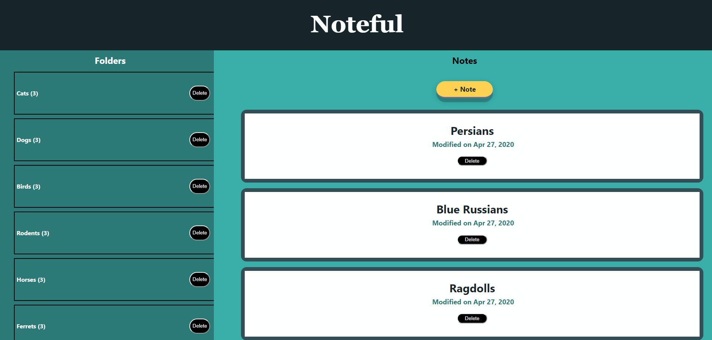
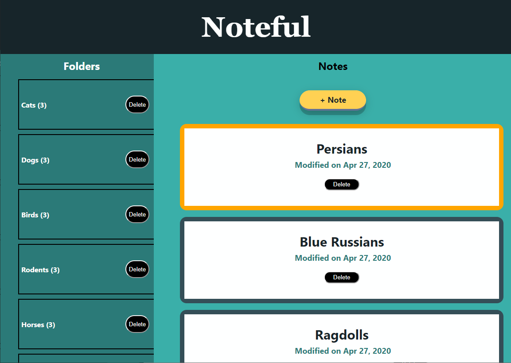
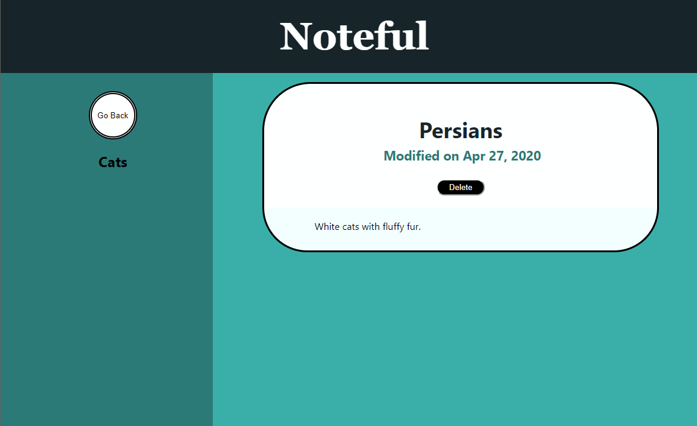
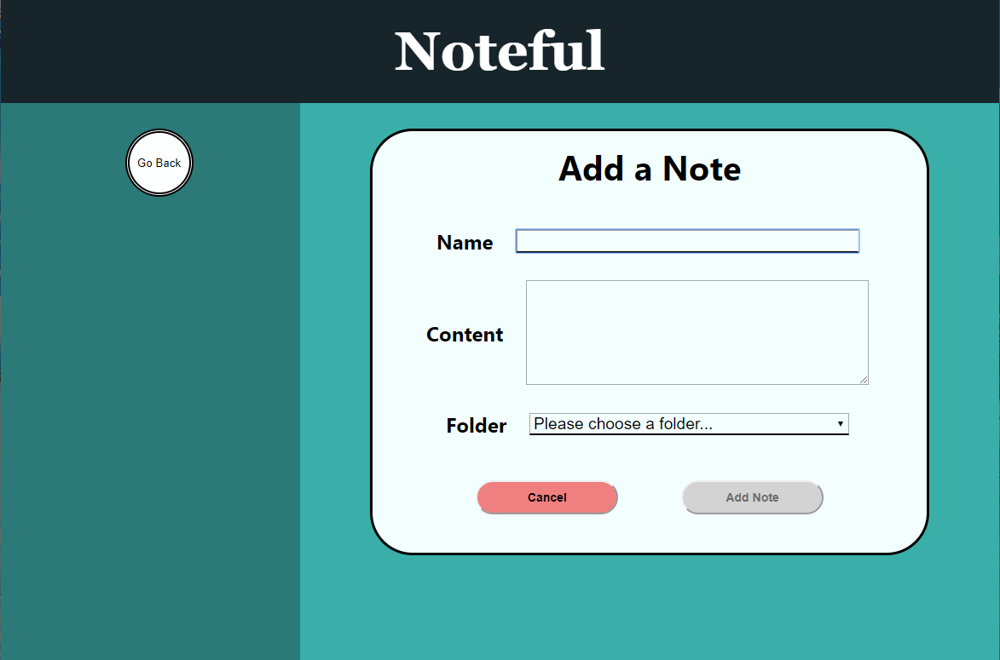
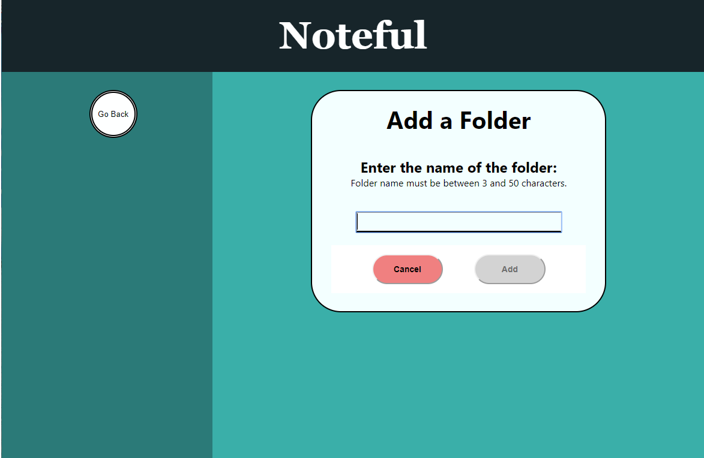

This project was bootstrapped with [Create React App](https://github.com/facebook/create-react-app).

This is my Noteful React Client that works with the noteful-server.

# Noteful Application with JSON
This app with allow you to create and add notes in folders.  

## Live App Link:  
https://noteful-app-jade.now.sh/

## Technologies Used:
HTML/CSS/JavaScript/React/APIs

## Motivation:  
Another fun project to better learn React!

## Summary: 
This noteful app was created for educational purposes for providing a user to create notes and organize them through folders.  Users can delete notes, folders, as well as add folders and notes as needed.  Data is retrieved from a Node/PosgreSQL created server that is hosted on Heroku.  When users click a note they will have the option to read the whole note as well as delete.  

## Screenshots:  

## Noteful JSON Server
This is a project for educational purposes created by Thinkful.
If started locally, this will run a local API server on `http://localhost:8000`.

The database is initiated from the `db.js` file whenever the server is started. No data is persisted after the server has been shut down.

## Production mode
http://localhost:5000
